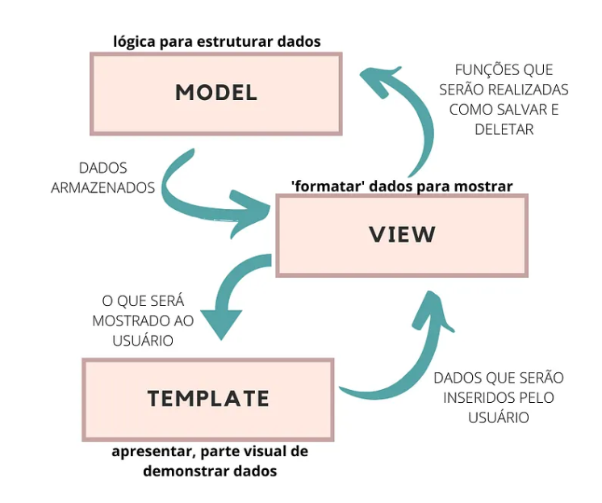

# Normas do projeto

Seguindo estas práticas, o projeto fica mais **organizado, seguro e fácil de manter**.

##  Arquitetura - MVT
Esse projeto utiliza o padrão MVT(Model-View-Template), arquitetura adotada pelo Django
### O que é MVT?

- Model: É o arquivo que contém a estrutura lógica do projeto e funciona como um intermediário para manipular dados entre o banco de dados e a View. Dentro desse arquivo é determinado quais tipos de dados, e como será armazenado dentro do seu banco e, como será exibido quando for requisitado pela View.
  - Exemplo: 
   ```python 
    class Student(Person):
        registration_date = models.DateField(auto_now_add=True)
        class_shift = models.CharField(choices=SHIFT_CHOICES, blank=False, null=False)
        university = models.CharField(choices=UNIVERSITY_CHOICES)
    ```

- View: O papel dessa camada é formatar os dados que são vindo do banco através da Model para visualização.
   - Exemplo: 
   ```python
    class StudentRetrieveUpdateDestroyView(RetrieveUpdateDestroyAPIView):
        permission_classes = (IsAuthenticated, GlobalDefaultPermission)
        queryset = Student.objects.all()
        serializer_class = StudentSerializer
    ```    

- Template: Cuida da parte desta visualização para o usuário final. Ele é como o front-end de sua aplicação.

No nosso caso, também utilizamos:
- Serializers para transformar dados dos modelos em JSON(e vice-versa).
- Generic views


## Testes

- Teste novas funcionalidades e correções

- Execute todos os testes antes de merge

- Cobertura mínima recomendada: ≥80%

## Conventional Commits
O Conventional Commits é uma convenção simples de mensagens de commit, que segue um conjunto de regras e que ajuda os projetos a terem um histórico de commit explícito e bem estruturado.

### Principais

- feat: inclusão de uma nova funcionalidade

- fix: correção de bug

- docs: mudanças apenas na documentação

- style: alterações de formatação/estilo que não afetam o código (espaços, indentação, ponto e vírgula, etc.)

- refactor: mudanças no código que não alteram o comportamento, mas melhoram a legibilidade/estrutura

- perf: alterações que melhoram a performance

- test: adição ou ajuste de testes

- chore: tarefas de manutenção que não afetam o código da aplicação (ex: atualizar dependências, configs de build)

### Secundários

- build: mudanças que afetam o sistema de build ou dependências externas (npm, pip, Docker, etc.)

- ci: alterações nos arquivos ou scripts de integração contínua (GitHub Actions, GitLab CI, CircleCI, etc.)

- revert: reverter um commit anterior

- temp: mudanças temporárias que devem ser removidas depois (muito usado em hotfixes rápidos ou debug)

### Menos comuns

- deps: atualização, adição ou remoção de dependências

- security: correções relacionadas a vulnerabilidades

- infra: mudanças na infraestrutura


